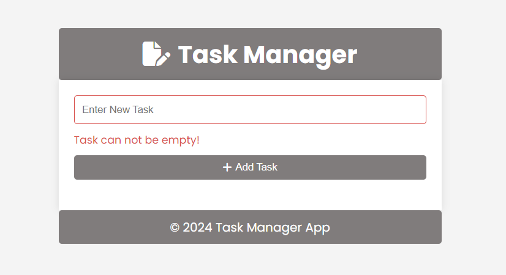

# Task Manager

A simple task manager web application to keep track of your to-do list. The app allows users to add, mark as complete, and delete tasks. It provides form validation to ensure tasks are not empty and offers a user-friendly interface.

## Features
- Header

 > Featured at the top of the page, the header shows the project name Task Manager.

 > 
- Add new tasks
- Mark tasks as completed
- Delete tasks

  >  

- Form validation for empty task input

    > 

- Footer

   > 

  

## Technologies Used

  - HTML
  - CSS
  - JavaScript
  - [Font Awesome](https://fontawesome.com/) for icons
  - [Google fonts](https://www.googlefonts.com)

## Usage

1. Enter a task in the input field.
2. Click the "Add Task" button to add the task to the list.
3. Click the check icon to mark a task as completed.
4. Click the trash icon to delete a task.
5. If the input field is empty, an error message will be displayed, and the task will not be added.

## Testing

> Testing on this project was mainly done manually by myself and a few friends to determine site usability, responsiveness and ensure it is intuitive to a completely new user.

## Google Lighthouse Testing

  > 

## HTML Validation

### index.html

  > 

#### Result: No Errors

## CSS Validation

  > 

#### Result: No Errors

## Deployment

> To deploy the project I followed these steps starting from the main project repository [here](https://mabuhanif.github.io/toDo-list/).

 1. Clicked on `Settings` on the navigation menu in the repository
 2. I then selected the `Pages` menu on the side bar.
 3. In the first dropdown menu labeled `Source` I selected the branch of the name `main` from the dropdown.
 4. In the next dropdown labeled `/root` I left as the default option.
 5. Selected Save
 
> I then received a notification from GitHub that my project is being deployed and after about 1 minute & a couple of refreshes of the page it was ready and live.

The live link can be found here - https://mabuhanif.github.io/toDo-list/

## Acknowledgements

> Font Awesome for icons